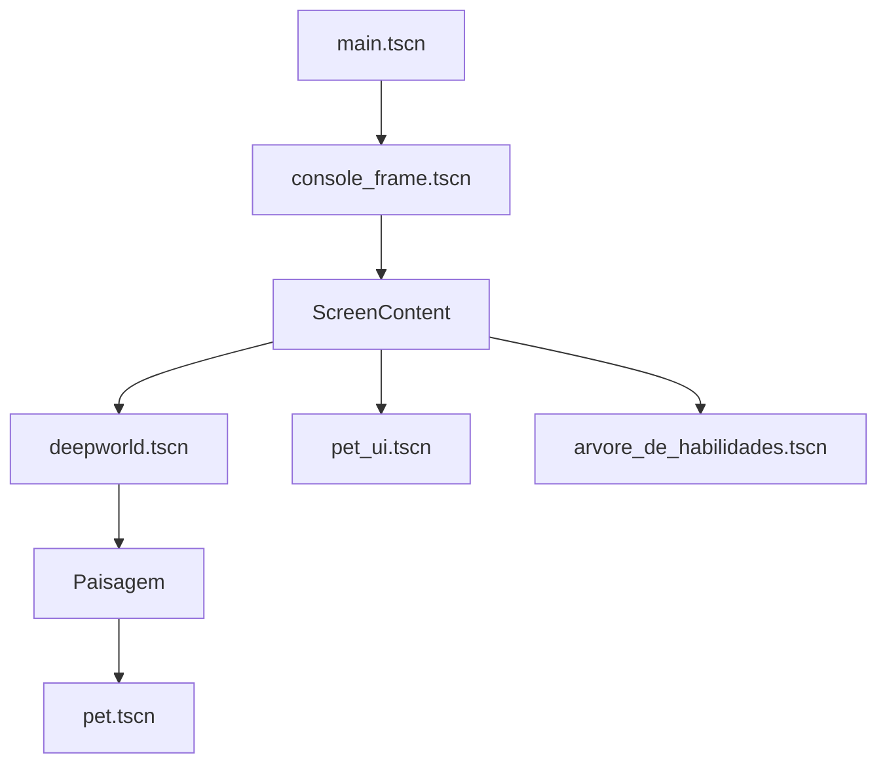

# AuroraPet — Guia de Desenvolvimento e Estado Atual

> Documento de referência para continuar o desenvolvimento do AuroraPet no Godot 4.7.1. Ele consolida o que está implementado no repositório, descreve como executar e testar o protótipo e separa as próximas tarefas de **lógica** das tarefas de **level design**.

**Estado de referência:** protótipo Godot validado em 20 de agosto de 2026.
**Repositório:** [Samukax7/aurorapet](https://github.com/Samukax7/aurorapet)  
**Engine:** Godot 4.7.1 stable  
**Cena de entrada:** `scenes/main.tscn`

## 1. Como interpretar este documento

O AuroraPet possui documentos de conceito, documentos de implementação e o código executável do protótipo Godot. Quando existe diferença entre uma funcionalidade descrita no GDD e o que aparece no jogo atual, este guia considera o **código do repositório como fonte de verdade**. Dessa forma, itens como persistência, minigames completos, combate PvE e overlays emocionais são tratados como planejados quando ainda não existem como sistemas jogáveis na versão Godot atual.

O projeto é desenvolvido em duas frentes. A frente de **lógica** implementa regras de necessidades, progressão, identidade, evolução, habilidades e integração entre sistemas. A frente de **level design** define composição visual, enquadramento, escala, paleta, ícones, plataforma, fundos e direção artística. Alterações de level design devem ser validadas criativamente antes de serem fixadas no código ou nas cenas.

## 2. Pré-requisitos e execução

É necessário utilizar o Godot 4.7.1 ou uma versão compatível da série Godot 4. O projeto deve ser aberto pela pasta que contém `project.godot`. A execução normal começa pela cena `scenes/main.tscn`, que monta o console completo e todas as cenas instanciadas.

### Passo a passo para abrir o protótipo

1. Abra o projeto no Godot 4.7.1.
2. Confirme que `scenes/main.tscn` está definida como cena principal.
3. Execute o projeto com **Play Project** ou pressione `F6` quando a cena principal estiver selecionada.
4. Aguarde o carregamento da mensagem de nascimento do pet.
5. Teste o D-pad, os botões coloridos, as barras de status, o menu, os submenus, o treino e a tecla `R`.
6. Para validar uma alteração de cena, feche a execução anterior antes de iniciar uma nova execução. Isso evita observar uma instância antiga mantida pelo editor.

Para uma validação sem interface gráfica em ambiente Linux, o comando equivalente é:

```bash
/home/ubuntu/Godot_v4.7.1-stable_linux.x86_64 \
  --headless --editor --path /caminho/para/aurorapet --quit
```

O resultado esperado é um encerramento com código `RC=0` e sem mensagens `SCRIPT ERROR` ou `ERROR:` relacionadas às cenas e scripts do projeto. Avisos de UID inválido podem aparecer em clones que ainda não foram reimportados pelo editor; o Godot utiliza o caminho textual do recurso como fallback nesses casos.

## 3. Arquitetura de cenas em cascata

A regra central do projeto é que cada cena seja editável de forma independente e que as alterações sejam refletidas automaticamente nas cenas superiores.



| Cena ou nó | Responsabilidade | Regra de edição |
|---|---|---|
| `main.tscn` | Entrada e composição final do jogo. | Não duplicar Deepworld ou UI diretamente aqui. |
| `console_frame.tscn` | Corpo do console, tela, D-pad e botões físicos. | Ajustar moldura e controles sem alterar a lógica do pet. |
| `ScreenContent` | Área útil interna da tela do console. | É a referência para o enquadramento do mundo e da UI. |
| `deepworld.tscn` | Fundo, plataforma, paisagem e instância do pet. | Ajustar composição do cenário nesta cena. |
| `pet.tscn` | Corpo modular, sistemas de identidade, necessidades, habilidades e evolução. | Alterações estruturais do pet devem ser feitas aqui. |
| `pet_ui.tscn` | Barras de status, menu principal, submenus e feedback. | Ajustar layout e apresentação aqui. |
| `arvore_de_habilidades.tscn` | Tela de treino e visualização dos estados de habilidades. | Mantém a apresentação separada da lógica em `PetSkills`. |

A posição atual do pet no Deepworld é `Vector2(0, 488)` dentro de `Paisagem`, com escala inicial `Vector2(4, 4)`. A plataforma fixa utiliza `z_index = 2`, o pet utiliza `z_index = 3`, a UI fica acima dessas camadas e a moldura da tela permanece à frente. O fundo usa `z_index = 1`, evitando que o corpo do console encubra o cenário.

A logo da abertura é filha de `ScreenContent`, mas sua centralização deve ser calculada pelo tamanho efetivo desse retângulo, não por uma coordenada fixa baseada apenas na cena `opening_flow.tscn`. O `OpeningFlow` calcula o centro como `(size - logo_size) / 2`, e o `ScreenContent` aplica a escala final do frame do console somente depois dessa composição.

## 4. Estrutura de pastas

```text
assets/
├── console/
│   ├── aurorapet-console-pixel-body.png
│   ├── aurorapet-screen-only-pixel-mockup.png
│   └── controles/
├── fundo/
│   ├── aurorapet-deepworld-landscape.png
│   ├── deepworld_plataforma.png
│   └── faccoes/
├── pet_modular/
│   ├── base/
│   └── modulos/
└── UI/
    └── submenus/

scenes/
├── main.tscn
├── console_frame.tscn
├── deepworld.tscn
├── pet.tscn
├── pet_ui.tscn
└── arvore_de_habilidades.tscn

scripts/
├── console_controller.gd
├── deepworld_controller.gd
├── pet_identity.gd
├── pet_randomizer.gd
├── pet_stats.gd
├── pet_skills.gd
├── pet_evolution.gd
├── pet_ui.gd
└── arvore_de_habilidades.gd

shaders/
└── menu_selection_glow.gdshader
```

## 5. Fluxo de inicialização do pet

Quando `main.tscn` é executada, o `ConsoleController` conecta os botões físicos e os sinais da interface. O `PetIdentity` garante que o pet possua uma identidade procedural. Em seguida, o `PetRandomizer` escolhe as peças modulares e a paleta, enquanto `PetStats`, `PetSkills` e `PetEvolution` inicializam seus estados e conectam os sinais de atualização.

A identidade e a aparência são deliberadamente separadas. A identidade define contexto e persistência futura; a aparência continua sendo formada pelos `Sprite2D` já existentes na cena do pet. O randomizador não cria nem remove nós, o que preserva a liberdade de prototipagem no editor.

### Identidade procedural atual

| Camada de identidade | Implementação atual |
|---|---|
| Facções | `luz`, `trevas` e `neutro` |
| Linhagens | Serafim, Fada Estelar, Sombra, Corvo Espectral, Espírito e Guardião Elemental |
| Elementos | Escolhidos dentro do conjunto permitido pela linhagem |
| Gênero | Feminino, masculino ou neutro |
| Nome | Prefixo e sufixo sorteados no banco da linhagem |
| Traços | Dois traços distintos escolhidos da linhagem |
| Bônus | Viés inicial de Força, Defesa, Agilidade e Inteligência |
| Repetibilidade | `identity_seed` e `generate_new_identity(seed)` |

A tecla `R` executa um novo sorteio visual, mas não troca nome, gênero, facção, linhagem, elemento ou traços. Para gerar uma nova criatura completa, deve-se chamar `generate_new_identity()` de forma explícita.

## 6. Pet modular, paleta e proporções

As camadas editáveis do pet são mantidas como nós independentes em `pet.tscn`. O conjunto atual inclui `CorpoBase`, `Cauda`, `Asas`, `Orelhas` e `Olhos`. A aparência é alterada por textura e modulação, não por criação dinâmica de nós.

O `PetRandomizer` trabalha com cinco variantes para olhos, orelhas, asas e caudas. As caudas possuem perfis individuais em `TAIL_SCALE_PROFILES`, pois suas artes não têm a mesma altura visual. A variante de cauda 1 preserva a escala manual aprovada durante a prototipagem.

A paleta cósmica possui vinte cores organizadas em dez pares complementares. A regra visual aprovada é:

| Grupo de peças | Cor aplicada |
|---|---|
| Corpo base, orelhas e cauda | Cor principal do par escolhido |
| Olhos e asas | Cor complementar da cor principal |

As cores foram escolhidas para manter contraste com a composição anil do Deepworld. A revisão de saturação e luminosidade continua sendo uma decisão de level design e não deve ser feita apenas por código.

## 7. Deepworld e plataforma

O Deepworld mantém um fundo padrão independente de facção. A propriedade atual do `DeepworldController` é `use_faction_backgrounds = false`, portanto o protótipo inicia com `assets/fundo/aurorapet-deepworld-landscape.png`. Essa decisão evita que uma identidade procedural altere o cenário antes da validação artística final.

A plataforma é fixa, permanece ativa durante toda a execução e não é trocada quando o fundo muda. As camadas de facção estão preparadas para uso futuro, mas sua composição deverá ser validada no Krita e no Godot antes de ativar a seleção automática.

| Camada | Nó | Estado atual | Profundidade |
|---|---|---|---:|
| Cenário padrão | `Cenario/Fundo` | Visível | `1` |
| Luz | `Cenario/FundoLuz` | Preparado, oculto por padrão | `1` |
| Trevas | `Cenario/FundoTrevas` | Preparado, oculto por padrão | `1` |
| Neutro | `Cenario/FundoNeutro` | Preparado, oculto por padrão | `1` |
| Plataforma | `Plataforma` | Sempre ativa | `2` |
| Pet | `Paisagem/Pet` | Sempre ativo | `3` |
| UI | `ScreenContent/PetUI` | Controlada pelo menu | Superior |

Para adicionar animação de fundo, os arquivos exportados do Krita devem conservar a mesma resolução, origem, escala e área segura. Novas camadas podem ser adicionadas dentro de `Cenario` sem quebrar a cascata, desde que não assumam profundidades inferiores ao corpo do console.

## 8. Sistema de necessidades e cuidado

`PetStats` implementa o ciclo de cuidado inspirado em V-Pets clássicos. Os valores principais exibidos na interface são fome, energia, humor e saúde. O sistema também mantém higiene, disciplina, peso, doença, sono e histórico de cuidado.

No primeiro nascimento, o loop tutorial começa com fome em 20% e energia em 30%. O objetivo inicial é alimentar o pet até a fome chegar a 100% e, em seguida, usar Cuidar > Dormir. Quando a energia volta a 100%, o tutorial concede XP suficiente para alcançar o nível 2 e libera Jogo da Velha como a primeira atividade da categoria Jogar.

As respostas visuais são separadas por origem. Mensagens de sistema usam um retângulo ciano acima da cabeça do pet; falas do pet usam um balão claro deslocado para a esquerda da cabeça. Cada ação emite `reaction_requested(action, reaction_id)`, atualiza `current_reaction` e dispara shake com uma partícula dedicada. O estado `reaction_animation_state` já está preparado para substituir as partículas por animações no `AnimationPlayer` quando as animações finais forem criadas.

As necessidades especiais usam dois sinais. Após três refeições bem-sucedidas, um marcador de sujeira aparece na tela e é removido por Limpar Sujeira. Periodicamente, o pet pode emitir uma vontade de brincar ou treinar; o indicador combina `!` com um símbolo específico da atividade. A primeira implementação usa Jogo da Velha e Força como exemplos, mantendo a tabela de eventos aberta para expansão futura.

O decaimento é intencionalmente tranquilo e ocorre por intervalos configuráveis, com intervalo padrão de um segundo. A saúde permanece protegida fora dos estados críticos. Resistência derivada dos atributos de treino reduz a velocidade efetiva de queda. Não existe morte permanente nesta fase do protótipo.

| Categoria | Ação | Efeito principal | XP |
|---|---|---|---:|
| Comer | Fruta Estelar | `+18` fome, `+2` humor, `+1` saúde, `+1` peso | 8 |
| Comer | Néctar Cósmico | `+28` fome, `+4` energia, `+2` saúde, `+2` peso | 8 |
| Comer | Banquete Nebulosa | `+42` fome, `+6` humor, `+3` saúde, `+4` peso | 8 |
| Cuidar | Dar Remédio | Trata doença ou restaura saúde | 8 |
| Cuidar | Limpar Sujeira | `+35` higiene, `+14` saúde, `+8` humor, `-3` energia | 8 |
| Cuidar | Dormir | Recupera energia e humor até a energia chegar a 100%; bloqueia as funções durante o processo | 8 |
| Jogar | Jokenpô | `+18` humor, custo de energia e fome | 15 |
| Jogar | Jogo da Velha | `+20` humor, custo de energia e fome | 20 |
| Jogar | 2048 | `+22` humor, custo de energia e fome | 20 |
| Treinar | Treino | `+4` disciplina, `+3` saúde, custo de energia e fome | 25 |
| Batalhar | Em breve | Ainda sem efeito de combate | 0 |

O sistema mantém chamadas de atenção quando uma necessidade entra em criticidade. A janela exportada de resposta é de quinze minutos. Se o jogador não responde, são registrados erro de cuidado, chamada perdida e perda gradual de disciplina. Higiene crítica prolongada pode gerar doença; sono cria um estado de recuperação, impede o decaimento normal e bloqueia todas as ações até a energia chegar a 100%. Durante o sono, a PetUI reduz visualmente o menu, exibe `Z z z` e recusa ações com uma mensagem de sistema.

## 9. Menu, submenus e controles

O menu principal possui cinco categorias: **Comer, Cuidar, Jogar, Treinar e Batalhar**. Comer abre as três comidas; Cuidar abre limpeza e dormir desde os primeiros níveis, enquanto remédio é liberado posteriormente. A ação legada de banho permanece bloqueada para uma implementação futura. Jogar abre Jogo da Velha primeiro, seguido de Jokenpô e 2048. Treinar abre a árvore de habilidades. Batalhar apresenta a mensagem de que o sistema ainda está em desenvolvimento.

O ícone selecionado recebe modulação completa, pequeno aumento de escala e um shader de glow que pulsa por 0,5 segundo. Os ícones não selecionados usam opacidade reduzida para melhorar a leitura sobre o cenário.

| Entrada | Função |
|---|---|
| D-pad ou setas direcionais | Move a seleção do menu, submenu ou árvore de habilidades |
| Botão verde ou `ui_accept` | Confirma a seleção |
| Botão amarelo | Alterna a visibilidade das barras de status |
| Botão rosa ou `ui_cancel` | Abre/fecha menu, volta do submenu ou fecha a árvore |
| Ao abrir Treinar | Exibe atributos RPG, progressão e habilidades no mesmo painel |
| Tecla `R` | Refaz o sorteio visual de peças e paleta, mantendo a identidade |

O `ConsoleController` é a camada de integração. Ele recebe ações da UI, encaminha os efeitos para `PetStats`, atribui XP em `PetSkills`, abre a árvore de habilidades e exibe mensagens de nascimento, evolução, nível e habilidades desbloqueadas. Ao abrir Treinar, ele injeta tanto `PetSkills` quanto `PetIdentity` na árvore, mantendo a ficha RPG sincronizada com a identidade procedural ativa.

## 10. Progressão, treino e evolução

`PetSkills` possui nível, XP atual, XP total e quatro atributos treináveis: Força, Defesa, Agilidade e Inteligência. A árvore atual contém oito habilidades: quatro iniciais e quatro avançadas. O desbloqueio verifica nível, XP total, atributo mínimo e pré-requisito.

A tela de Treinar funciona como o primeiro painel de progressão para o combate. Além da árvore de habilidades, ela exibe uma ficha compacta com nome, linhagem, elemento, nível, XP total e os quatro atributos RPG atuais do pet. Os valores vêm diretamente de `PetSkills`, portanto permanecem iguais aos valores apresentados na ficha de nascimento e refletem imediatamente bônus de linhagem e treino. A estrutura visual foi organizada com o painel `AttributesPanel` ao lado das duas colunas de habilidades, mantendo o espaço preparado para adicionar estatísticas de combate, resistências e equipamentos posteriormente.

O XP é concedido por ações de cuidado, jogos e treino. O nível sobe enquanto o XP atual alcança `level * 100`. Ao subir de nível, o sistema sincroniza `PetEvolution` e tenta desbloquear habilidades disponíveis.

Para reduzir a repetição no início sem tornar a progressão instantânea, cada ação básica de cuidado concede 8 XP. Com esse valor, o nível 2 exige aproximadamente 13 cuidados, o nível 3 exige aproximadamente 38 cuidados acumulados desde o nascimento e o nível 4 exige aproximadamente 75 cuidados acumulados, caso o jogador não utilize os minigames. Jokenpô continua concedendo 15/5/2 XP por vitória, empate e derrota; Jogo da Velha concede 20/8/3 XP; e Treinar concede 25 XP.

`PetEvolution` contém sete estágios: Bebê, Criança, Juvenil, Jovem, Adulto, Forma Máxima e Entidade Cósmica. A escala inicial foi ajustada para `4.0` para corresponder ao enquadramento visual aprovado. As escalas atuais são `4.0`, `4.6`, `5.2`, `6.0`, `7.0`, `8.0` e `9.2`. Os perfis de variantes de olhos, orelhas, asas e cauda são aplicados por estágio, embora ainda faltem assets exclusivos de aura, roupas, acessórios e efeitos para os estágios finais.

### Desbloqueio gradual do menu

O menu acompanha o crescimento do pet. As categorias permanecem visíveis desde o nascimento, mas aparecem apagadas enquanto ainda estão bloqueadas. As opções internas também são liberadas gradualmente, criando objetivos claros sem esconder conteúdo futuro.

| Nível | Conteúdo liberado |
|---:|---|
| 1 | Comer, Cuidar, Fruta Estelar, Limpar Sujeira e Dormir |
| 2 | Jogar, Jogo da Velha, Néctar Cósmico e Dar Remédio |
| 3 | Jokenpô e Banquete Nebulosa |
| 4 | Treinar e a árvore de habilidades |
| 5 | 2048 |
| 6 | Batalhar |

Uma seleção bloqueada exibe a mensagem `DESBLOQUEIA NO NÍVEL X`, e a confirmação não executa a ação. Dormir permanece disponível desde o nível 1 para que o jogador consiga recuperar energia no começo do jogo. Banho está explicitamente bloqueado no nível 99, funcionando como conteúdo reservado para uma implementação futura. Ao subir de nível, a `PetUI` atualiza imediatamente o estado visual das categorias e mostra a mensagem `NOVO CONTEÚDO DISPONÍVEL`.

O onboarding utiliza mensagens contextuais sem criar uma tela tutorial separada: primeiro orienta a alimentação, depois indica o sono e, ao concluir o descanso, informa o nível 2 e a liberação de Jogo da Velha. Essa estrutura transforma a necessidade do pet em uma sequência curta de aprendizagem e recompensa.

## 11. Procedimento de teste manual

A validação deve ser feita em blocos, para que uma falha de arte não seja confundida com uma falha de lógica.

### Teste de carregamento

Abra `main.tscn`, execute o projeto e confirme que o console, o fundo padrão, a plataforma e o pet aparecem na tela. O pet deve começar com a escala visual aprovada, apoiado na plataforma, e o fundo não deve ser coberto pelo corpo branco do console.

### Teste de identidade e aparência

Observe a mensagem `NASCEU: NOME • LINHAGEM`. Pressione `R` várias vezes. As peças e a paleta devem mudar, mas nome, facção, linhagem, elemento e traços devem permanecer os mesmos. Confirme que base, orelhas e cauda compartilham a cor principal e que olhos e asas usam a complementar.

### Teste de navegação

Use o D-pad para percorrer as cinco categorias. O item selecionado deve acender com glow temporizado. Confirme Comer, Cuidar e Jogar, abra cada submenu e retorne com o botão rosa. Abra Treinar e verifique a separação entre habilidades desbloqueadas e bloqueadas. Batalhar deve mostrar apenas a mensagem provisória.

### Teste de necessidades

Execute uma ação de comida, limpeza, remédio, sono, jogo e treino. Confira as quatro barras e o resumo de higiene, disciplina, peso, doença e sono. Confirme que cada cuidado básico concede 8 XP, que o Jogo da Velha exibe a mesma recompensa que entrega e que o treino concede 25 XP. Pressione o botão amarelo para esconder e exibir as barras. Para testar criticidade, reduza temporariamente um valor no Inspector ou utilize um método de debug; confirme a chamada de atenção e a proteção da saúde fora da criticidade.

### Teste de progressão

Em um novo nascimento, confirme que o pet inicia com fome 20% e energia 30%. Alimente-o até 100%, abra Cuidar > Dormir e aguarde o ciclo de 12 segundos. A mensagem deve avançar de alimentação para sono e, ao final, o pet deve chegar ao nível 2 com Jogo da Velha liberado e visualmente como primeira opção de Jogar. Execute também treino e ações com XP para confirmar a progressão geral, a tentativa automática de desbloqueio e a evolução a partir da escala `4.0`, sem remover nós da cena `pet.tscn`.

### Teste de composição

No editor, confira `deepworld.tscn` e preserve a plataforma fixa. O fundo padrão deve permanecer em `z_index = 1`, a plataforma em `2`, o pet em `3` e a UI acima. Se novos fundos forem importados do Krita, confirme resolução, origem e base alinhada antes de ativar a troca por facção.

## 12. Critérios de aceite do estado atual

| Área | Critério |
|---|---|
| Cascata | Alterações em `pet.tscn`, `deepworld.tscn` e `console_frame.tscn` propagam para `main.tscn`. |
| Modularidade | Peças são editáveis como `Sprite2D` e o randomizador não cria nem remove nós. |
| Identidade | A identidade procedural é separada da aparência e pode ser repetida por seed. |
| Cuidado | Necessidades, decaimento, sono, doença, chamadas e histórico funcionam no protótipo. |
| Progressão | XP, nível, treino, habilidades e evolução estão conectados. |
| Interface | Cinco categorias, submenus, barras, mensagens e glow funcionam. |
| Deepworld | Fundo padrão aparece, plataforma é fixa e o pet permanece apoiado. |
| Estabilidade | A validação headless do Godot termina sem erros de script. |

## 13. O que já está feito e o que ainda não deve ser considerado concluído

O protótipo Godot já possui uma base sólida de cuidado, identidade procedural, aparência modular, progressão, habilidades, evolução visual, composição de console e direção inicial de Deepworld. Esses sistemas foram validados em blocos e publicados no GitHub.

Entretanto, a existência de uma opção no menu não significa que a mecânica completa esteja pronta. As entradas Jokenpô, Jogo da Velha, 2048 e Batalhar já existem no fluxo da interface e aplicam efeitos de protótipo quando apropriado, mas os minigames completos, o combate PvE, os inimigos Eco e a resolução de turnos ainda precisam ser implementados no projeto Godot. Da mesma forma, o loop possui estados de doença e sono, mas ainda precisa de overlays visuais de emoção com assets próprios.

## 14. Próximos acréscimos recomendados

A sequência recomendada deve reduzir dependências e produzir incrementos testáveis. A prioridade máxima é criar uma estrutura de estado única e persistente, porque identidade, necessidades, progressão e histórico já possuem dados suficientes para serem salvos. O primeiro formato deve ser JSON local, com carregamento seguro, versão de schema e backup; Firebase pode entrar depois sem misturar rede com a prototipagem offline.

| Prioridade | Frente | Próximo acréscimo | Motivo |
|---:|---|---|---|
| 1 | Lógica | Persistência local JSON de identidade, necessidades, XP, habilidades, evolução e histórico | Fecha o ciclo do V-Pet e prepara Firebase. |
| 2 | Lógica | Overlay de emoções e estados visuais | Conecta doença, sono, humor e chamadas à leitura do jogador. |
| 3 | Lógica | Jokenpô funcional como primeiro minigame completo | Valida recompensas, fluxo de retorno e integração com XP. |
| 4 | Lógica | Sistema de combate PvE mínimo com quatro slots | Dá função real à árvore de habilidades e à facção. |
| 5 | Lógica | Tela de ficha do pet e histórico de progressão | Torna identidade, atributos e evolução legíveis. |
| 6 | Level design | Separar os fundos do Krita em camadas com mesma resolução | Prepara parallax, nuvens, estrelas e efeitos sem quebrar o enquadramento. |
| 7 | Level design | Criar aura, acessórios e roupas de estágios finais | Diferencia visualmente a progressão além do aumento de escala. |
| 8 | Level design | Revisar contraste, saturação e leitura do menu | Garante que glow e ícones continuem claros em todos os fundos. |
| 9 | Produto | Sons de confirmação, recusa, doença, evolução e batalha | Reforça feedback sem sobrecarregar a tela. |
| 10 | Produto | Conquistas, álbum de memórias e modo fotografia | Cria recompensas de longo prazo depois que o loop principal estiver estável. |

A próxima tarefa recomendada é a **persistência local JSON**, seguida pelo primeiro minigame funcional. A implementação deve preservar a cascata e manter os sistemas acessíveis por sinais, para que a futura migração para Firebase não obrigue a reescrever `PetStats`, `PetSkills` ou `PetIdentity`.

## 15. Regras para continuar o desenvolvimento

Toda alteração estrutural do pet deve ser feita em `pet.tscn`, sem criar ou destruir Sprite2D por código. Toda alteração de composição do Deepworld deve ser validada no editor antes de ser automatizada. A plataforma deve permanecer fixa enquanto apenas o fundo troca. Arquivos separados no Krita devem manter a resolução e a origem das camadas atuais.

Depois de cada bloco significativo, execute a validação headless do Godot, teste manualmente a cena principal e remova arquivos temporários de validação da pasta do projeto. Commits devem agrupar mudanças coerentes, com mensagens que descrevam o resultado. O GitHub deve ser atualizado após blocos estáveis, não a cada tentativa experimental.

## 16. Referências internas

Este guia foi consolidado a partir do GDD de laboratório, do guia técnico, da apresentação e do diário de bordo compartilhados no projeto, além da implementação real no repositório Godot.

- [Sistema de necessidades](NEEDS_SYSTEM.md)
- [Identidade procedural híbrida](PROCEDURAL_IDENTITY.md)
- [Camadas do Deepworld](DEEPWORLD_LAYERS.md)
- [Checklist do projeto](todo.md)
- [PetStats](scripts/pet_stats.gd)
- [PetSkills](scripts/pet_skills.gd)
- [PetIdentity](scripts/pet_identity.gd)
- [PetRandomizer](scripts/pet_randomizer.gd)
- [PetEvolution](scripts/pet_evolution.gd)
- [PetUI](scripts/pet_ui.gd)
- [ConsoleController](scripts/console_controller.gd)

## 17. Histórico recente de implementação

| Commit | Resultado |
|---|---|
| `037781e` | Fundos do Deepworld acima do corpo do console |
| `de0eb52` | Escala inicial e crescimento evolutivo recalibrados |
| `bc71257` | Fundo padrão e glow de seleção do menu |
| `b4e0120` | Posição anterior do menu restaurada |
| `4b0f7b3` | Menu visível na tela do console |
| `45ff266` | Layout das barras e fallback do fundo |
| `d745963` | Plataforma fixa no Deepworld |
| `3ed37a3` | Camadas do Deepworld por facção |
| `e760836` | Identidade procedural híbrida |

**Próxima revisão sugerida:** atualizar este documento sempre que um bloco de lógica ou level design atingir um estado validado no jogo, especialmente após persistência, minigame funcional, combate PvE ou importação das novas camadas do Krita.
